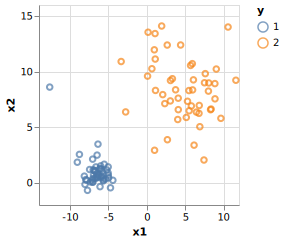
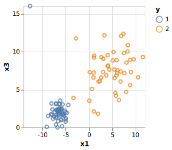
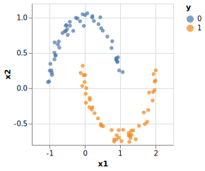

# Generating Synthetic Data

MLJ has a set of functions - `make_blobs`, `make_circles`,
`make_moons` and `make_regression` (closely resembling functions in
[scikit-learn](https://scikit-learn.org/stable/datasets/index.html#generated-datasets)
of the same name) - for generating synthetic data sets. These are
useful for testing machine learning models (e.g., testing user-defined
composite models; see [Composing Models](@ref))


##  Generating Gaussian blobs

```@docs
make_blobs
```


```@example foggy
using MLJ, DataFrames
X, y = make_blobs(100, 3; centers=2, cluster_std=[1.0, 3.0])
dfBlobs = DataFrame(X)
dfBlobs.y = y
first(dfBlobs, 3)
```

```julia
using VegaLite
dfBlobs |> @vlplot(:point, x=:x1, y=:x2, color = :"y:n") 
```





```julia
dfBlobs |> @vlplot(:point, x=:x1, y=:x3, color = :"y:n") 
```





##  Generating concentric circles

```@docs
make_circles
```


```@example foggy
using MLJ, DataFrames
X, y = make_circles(100; noise=0.05, factor=0.3)
dfCircles = DataFrame(X)
dfCircles.y = y
first(dfCircles, 3)
```


```julia
using VegaLite
dfCircles |> @vlplot(:circle, x=:x1, y=:x2, color = :"y:n") 
```


##  Sampling from two interleaved half-circles

```@docs
make_moons
```


```@example foggy
using MLJ, DataFrames
X, y = make_moons(100; noise=0.05)
dfHalfCircles = DataFrame(X)
dfHalfCircles.y = y
first(dfHalfCircles, 3)
```


```julia
using VegaLite
dfHalfCircles |> @vlplot(:circle, x=:x1, y=:x2, color = :"y:n") 
```





## Regression data generated from noisy linear models

```@docs
make_regression
```


```@example foggy
using MLJ, DataFrames
X, y = make_regression(100, 5; noise=0.5, sparse=0.2, outliers=0.1)
dfRegression = DataFrame(X)
dfRegression.y = y
first(dfRegression, 3)
```
	
